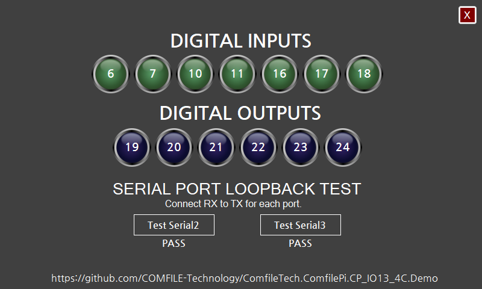

# ComfileTech.ComfilePi.CP_IO14_N.Demo

This is a .NET 10 WinForms application that demonstrates features of the [CP-IO14-N](https://comfiletech.com/raspberry-pi-panel-pc/cp-io14-n-i-o-board-accessory-for-cpi-g070wr/) IO board for the [ComfilePi industrial touchscreen panel PCs](https://comfiletech.com/linux-panel-pc/), and how to program it.

The demo uses Microsoft's WinForms implementation when targeting Windows (`net10.0-windows`) and [ComfileTech.WinForms](https://www.comfilewiki.co.kr/en/doku.php?id=winforms:index) when targeting Linux (`net10.0`). This replaces the previous `.NET Framework 4.8 + Mono` deployment model. On current ComfilePi OS images, ComfileTech.WinForms applications will run without installing Mono.

This application uses the following .NET libraries:
* [System.Device.Gpio](https://www.nuget.org/packages/System.Device.Gpio/)
* [System.IO.Ports](https://www.nuget.org/packages/System.IO.Ports/)
* [ComfileTech.WinForms](https://www.comfilewiki.co.kr/en/doku.php?id=winforms:index)

Both the `ComfileTech.ComfilePi.CP_IO14_N.Demo` project and the `ComfileTech.ComfilePi.CP_IO14_N` project target .NET 10.

## Deploying to and Debugging on a ComfilePi Panel PC

To debug the Linux target from Visual Studio, install COMFILE Technology's [Remote .NET Debugger extension](https://www.comfilewiki.co.kr/en/doku.php?id=comfilepi:dotnet_core_development:remote_debugger:index), then edit the `Remote linux-arm64` launch profile with the target device's connection settings.

To publish for a ComfilePi panel PC from Visual Studio:

1. Right-click the `ComfileTech.ComfilePi.CP_IO14_N.Demo` project and choose **Publish**.
2. Select the `linux-arm64.pubxml` profile.
3. Publish the project, then copy the published files to the ComfilePi.
4. On the ComfilePi, run `chmod +x Demo` and then launch the executable with `./Demo`.

## Designer Not Displaying in Visual Studio

This application uses [Nanum Gothic](https://fonts.google.com/specimen/Nanum+Gothic) fonts so it can display both English and Korean text, and be portable between Windows and Linux without licensing issues. There appears to be a bug in Visual Studio that prevents the WinForms designer for the main `Form1.cs` from displaying if the form's fonts are not installed. If you encounter this issue, please install the [Nanum Gothic](https://fonts.google.com/specimen/Nanum+Gothic) font package, and then the designer should display.
